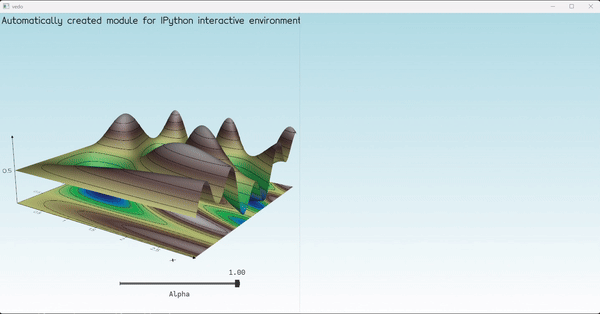
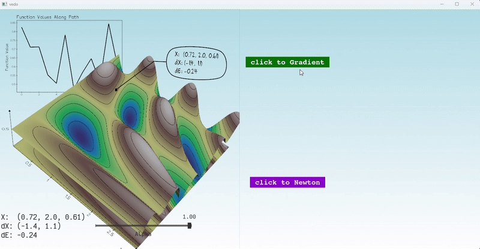
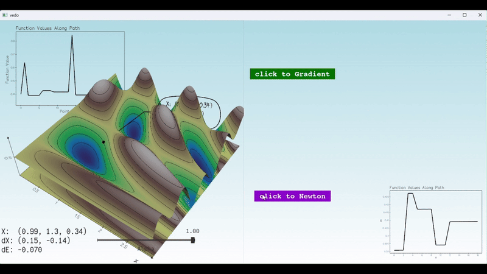

# Animation and Robotics - Assignment 1: <br> 
## Optimization and Visualization Basics


<details> 

<summary> Click here to read more

**Introduction**

</summary>
Both animation and robotics heavily rely on optimization algorithms. In order to understand what is happening inside the optimizer, and to debug efficiently, we must emply *interactive* visualization technique. Interactive means that it is possible to change parameters during runtime and see the change in result immediately, without having to stop, edit, and run again.
In this introductory assignment you will experiment with basic optimization and visualization techniques. The goal is to introduce you an important, different way of coding that is geared toward interactive techniques. This will be important in the rest of the class.

</details>


## Tasks


### Task 1: Understand the code
<details>
<summary> Subsection 1.1

**Mouse Right Button Press**
</summary>
The right click creates an animation of Archimedean spiral path in 3D space using parametric equations with height following the objective function:

- `x(t) = x₀ + r(t)cos(t)`
- `y(t) = y₀ + r(t)sin(t)`
- `z(t) = f(x(t), y(t))`

Where:
- `(x₀, y₀)` is the clicked point
- `t ∈ [0, 4π]` creates two rotations
- `r(t)` grows linearly from 0 to 0.2
- `f(x,y)` is the objective function


 <figure>
    <br>
  <figcaption>Figure 1: right-click</figcaption>
</figure>
</details>

<details>
<summary> Subsection 1.2

**A Graph Of The Function Values On The Path**
</summary>

 <figure>
    <br>
  <figcaption>Figure 2: 2d graph</figcaption>
</figure>
</details>

---

### Task 2: Optimize
<details>
<summary> Subsection 2.1

**Improvement of the optimization process**
</summary>

I implemented several enhancements:

- **Regularization of Hessian Matrix:**
  - In Newton's Method, the Hessian matrix is sometimes singular or ill-conditioned, leading to unstable steps. To address this, I added a small regularization factor (`epsilon`) to the diagonal of the Hessian:
    ```python
    H_reg = H + epsilon * np.eye(len(H))
    ```
  - This ensures the matrix is invertible and improves numerical stability.

- **Step Size Constraint:**
  - To prevent steps from becoming excessively large, I normalized the step direction and constrained its length:
    ```python
    if np.linalg.norm(d) > max_step:
        d = d / np.linalg.norm(d) * max_step
    ```
  - This ensures the optimization process progresses smoothly without overshooting.

- **Line Search Improvement:**
  - I implemented a more robust line search algorithm to dynamically adjust the step size (`alpha`) during each iteration.This ensures that the step size decreases if the function value does not improve:
    ```python
    while func(X[:2] + d * alpha) >= func(X[:2]) and alpha > tol:
        alpha *= beta
    ```


**Note:** 

The `OnMouseMove` callback was removed to focus on the optimization process and ensure that the starting point is explicitly set and remains clear during testing.

This simplifies the evaluation and avoids unintended path creation during optimization.


</details>

---

### Task 3: Evaluate

<details>
<summary> Subsection 3.1

**Comparison of Gradient Descent and Newton's Method**
</summary>
I tried to see how many steps it will take for each method to converge to the same point.

- **Convergence results:**
  - **Gradient Descent:** Converged in ~15 steps to a function value of `~0`.  
    This is because Gradient Descent takes smaller steps as it approaches the minimum, relying on the gradient's direction and magnitude. This method is slower but more robust when the objective function has a complex surface.
  - **Newton's Method:** Converged in only 3 steps to the same function value `~0`.  
    Newton's Method uses second-order information (the Hessian matrix) to take larger, more accurate steps toward the minimum. This leads to faster convergence, especially near the minimum, but it requires more computational resources and can be unstable if the Hessian is poorly conditioned.

- **Gradient Descent Path:**
  <figure>
    <br>
    <figcaption>Figure 3: Gradient Descent Path visualization. The method progresses steadily, taking smaller steps near the minimum.</figcaption>
  </figure>

- **Newton’s Method Path:**
  <figure>
    <br>
    <figcaption>Figure 4: Newton's Method Path visualization. The method converges quickly due to its second-order calculations.</figcaption>
  </figure>

**Explanation:**  
The significant difference in the number of steps is due to how each method calculates its direction and step size.

Gradient Descent is simpler and more general-purpose, while Newton's Method is highly efficient near smooth, well-behaved minima.

However, Newton's Method can face challenges with singular Hessians or poorly conditioned surfaces, which is why regularization and step size constraints were added to improve stability.

