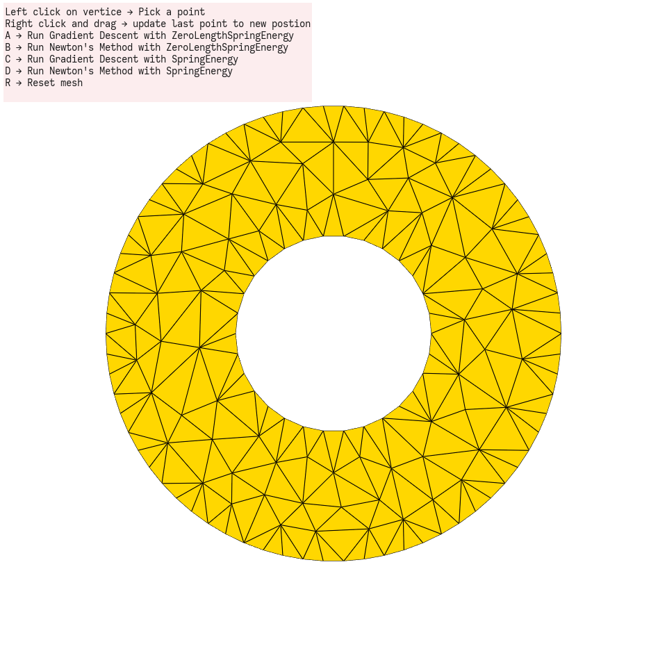
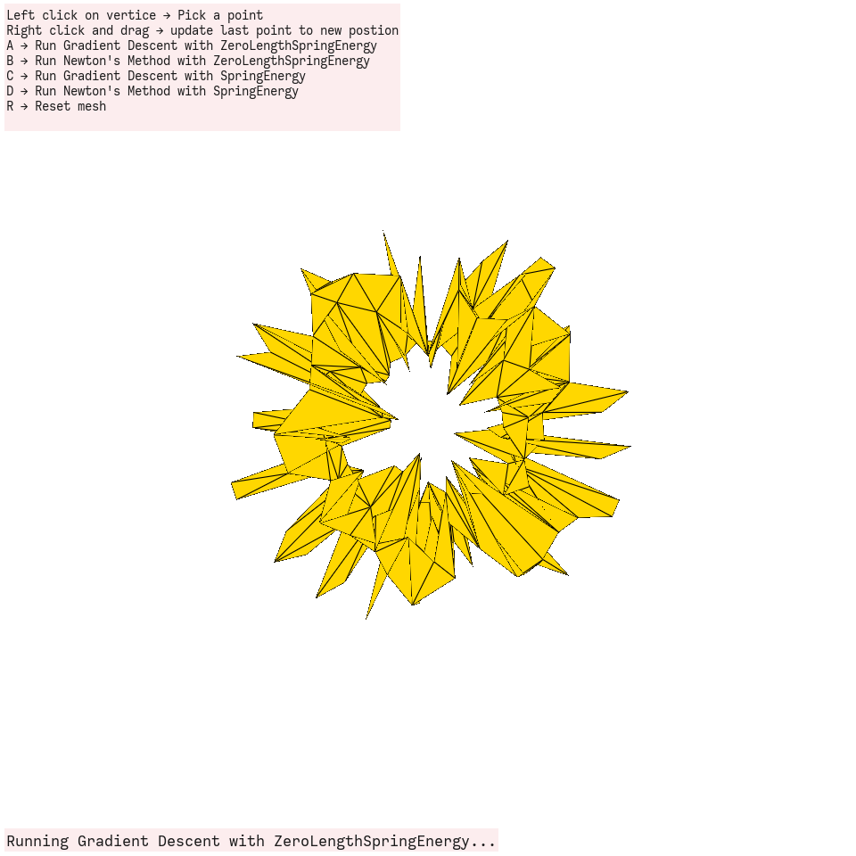
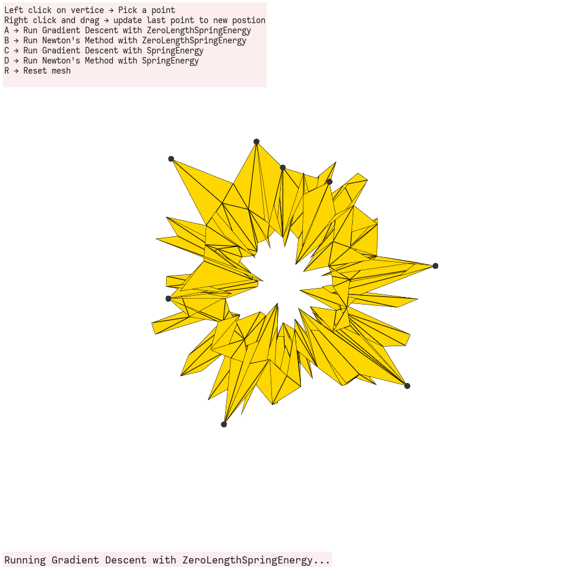
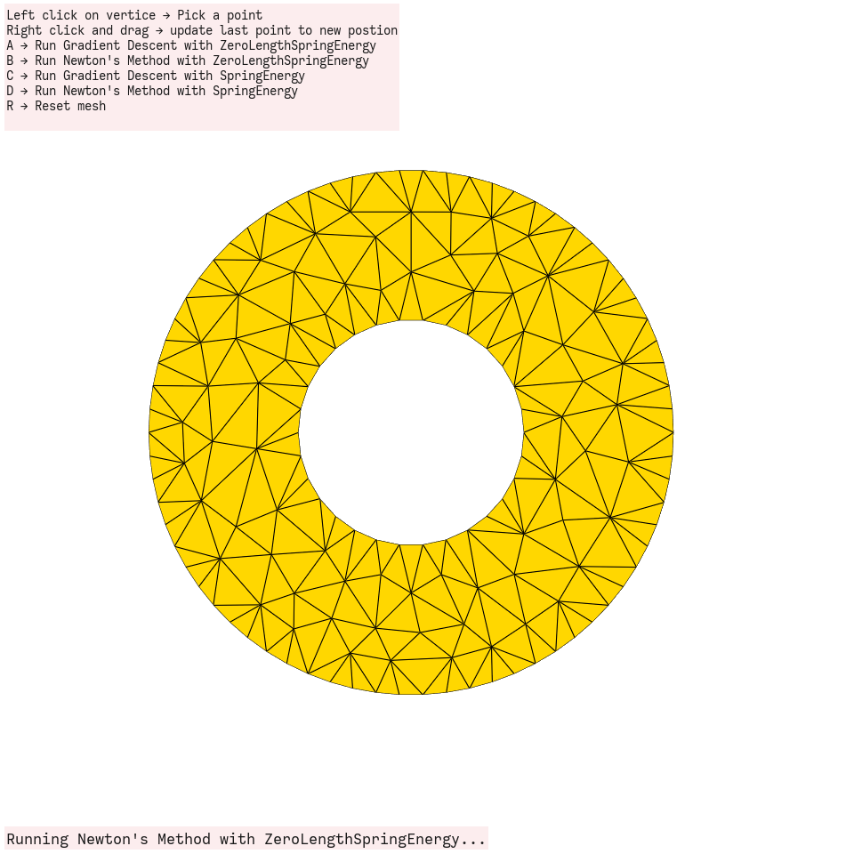
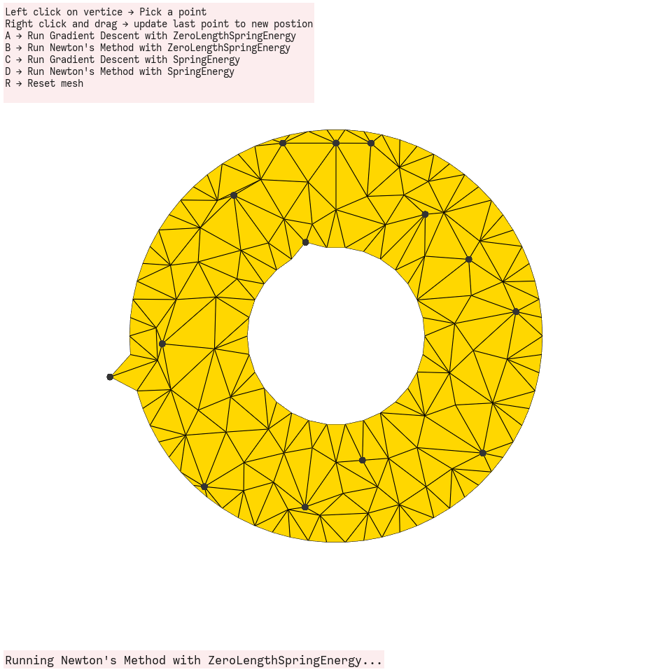
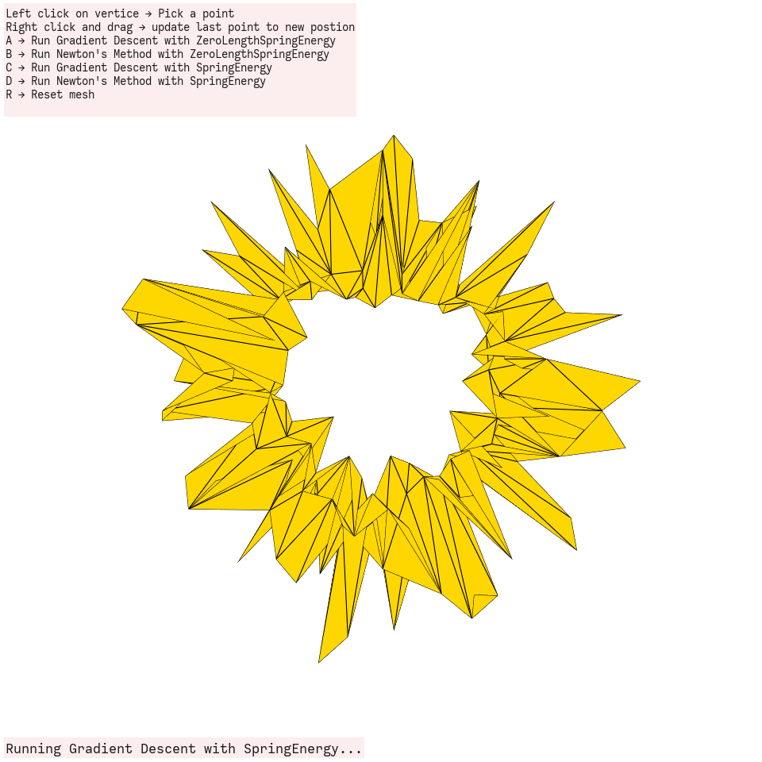
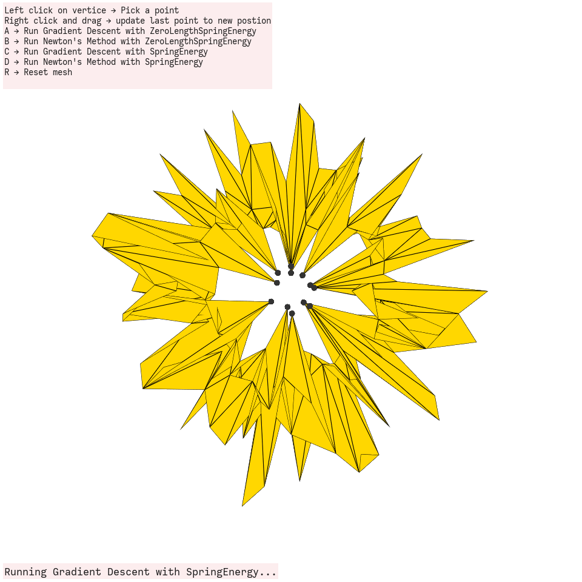
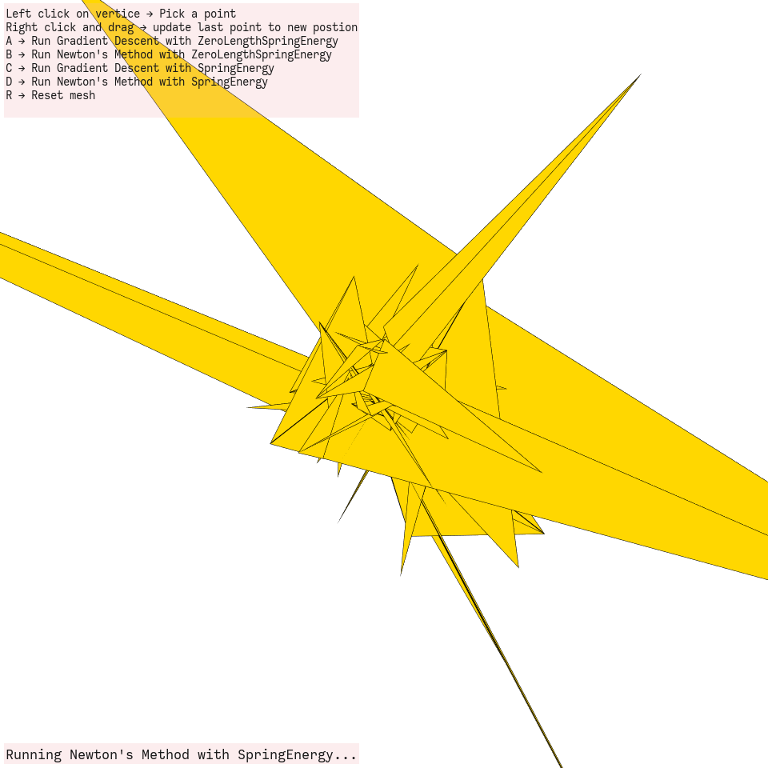
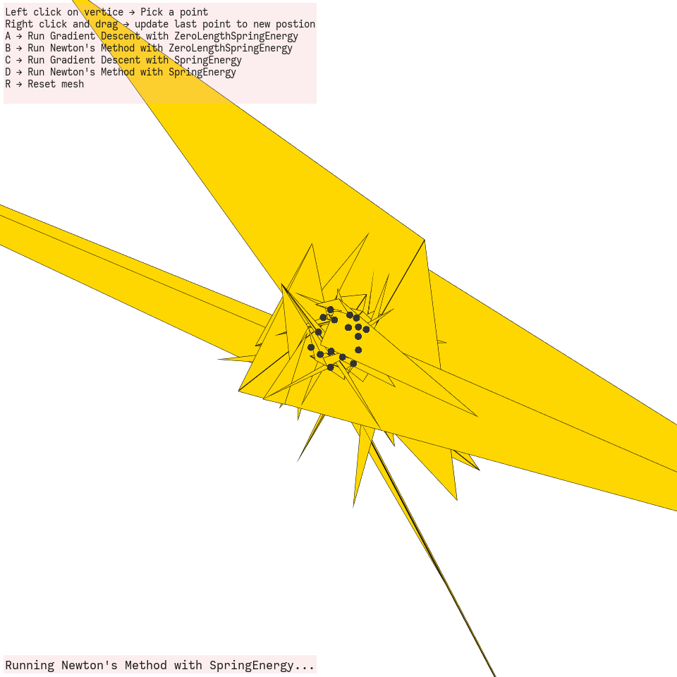

# Animation and Robotics - Assignment 2:   Deformation (Mass-Spring systems)

 Click here to read more

**Introduction**

A mass-spring system is one of the simplest models for an elastic object, yet implementing a simulator for such a system provides a solid foundation for understanding more complex models. Most simulators rely on the same building blocks regardless of the model, making the transition to sophisticated models more about changing a few formulas.

In this assignment, you will implement a static mass-spring system simulation. Static here means the simulator will only compute the steady-state, motionless configuration. You will learn about the common classes used in simulation and create a minimal GUI for interacting with the simulator.

The initial code for the assignment comes with a few basic classes to help you organize. These types of classes are commonly found in simulator code, but other structures and variation exist. They are roughly divided to classes that are related to the definition of the mesh and its energies, and the solver, also called optimizer. If you inspect the code, you will see a class called `FEMMesh`, which stores the topology of the mesh and its rest pose X and can compute the energy (and gradient and Hessian) given a deformed pose x. The energy is computed by itereating over all of the elements (edge, triangles, etc.) and summing up all of their energies. The computation of energy of each element are delegated to a different class which inherits from an abstract ElementEnergy class. Instances of this class are expected to implement an `energy` method, and can optionally implement a gradient and Hessian methods. If the gradient and Hessian are not implemented, the computation fallsback on the base class' finite difference computation.

The solver is comprized of several methods. The most front-facing one is `optimize`, which iteratively calls `step` to improve the solution. `step` consists of a `SearchDirection` method, and a `LineSearch` method, both of which point to one of several options. In our case, `GradientDescent` and `Newton` are implemented for the `SearchDirection` and only `BacktrackingLineSearch` is implemented for the line search. The compute the search direction, the solver simply calls the energy, gradient and Hessian methods of the FEMMesh class, and updates the deformed pose accordingly, using the line search function to insure a decrease in every iteration.

## Tasks

### Task 1: Create a mesh for the simulation

 Subsection 1.1

**Creating a Different Shape**

**I created a donut shape instead of the original square mesh**

The donut shape is generated using two concentric circles:

an outer circle (radius = 1.4) and an inner circle (radius = 0.6). The vertices of both circles are created using polar coordinates:

    <code>x = R ⋅ cos(θ), y = R ⋅ sin(θ)</code>

where <code>θ</code> is evenly spaced in <code>[0, 2π]</code>.

The `triangle` library is used to triangulate the combined circles, preserving the hole in the center to form the donut topology.

<figure>
       
<figcaption>

donut shape

</figcaption>
</figure>

<figure>
       
<figcaption>

donut shape with ~100 vertices

</figcaption>
</figure>

---

### Task 2: Implement Basic UI for Moving Points

 Subsection 2.1

**A mechanism that would allow the user to pin vertices and move pinned vertices to new locations**

- **Left click** on vertice -> a vertex is selected
  
- **Right click** and drag -> the vertex is dragged, its neighboring vertices are influenced based on their proximity to the dragged vertex

    - The neighbors (<code>xi</code>) of the dragged vertex (<code>xdragged</code>) are determined (<code>wi</code>) using a **linear weighting function**, defined by a radius (<code>r</code>):

    

        <code>wi = max(0, 1 - ||xi - xdragged|| / r)</code>
    

    - The displacement of the dragged vertex is applied to its neighbors, weighted by their distance to the dragged vertex.
        - Vertices closer to <code>xdragged</code> are more affected by the displacement.
        - The influence decreases linearly with distance, becoming zero for vertices beyond the defined radius <code>r</code>.

<figure>
       
<figcaption>

Example with <code>r = 0.01</code>

</figcaption>
</figure>

---

### Task 3: Test the optimization pipeline

 Subsection 3.1

**Convergence Analysis**

**Note on Iterations:**  
Due to the rapid convergence of the methods, a single iteration was sufficient to achieve significant results.

| Key   | Method               | Energy Type             | Energy Before   | Gradient Norm   | Alpha (Step Size) | Energy After      | Observations                                                                 |
|-------|----------------------|-------------------------|-----------------|-----------------|-------------------|-------------------|----------------------------------------------------------------------------|
| **A** | Gradient Descent     | ZeroLengthSpringEnergy  | 123.961126      | 32.700981       | 1.000000          | 0.28, approx.    | Vertices moved toward the center of mass; rapid convergence.               |
| **B** | Newton's Method      | ZeroLengthSpringEnergy  | 448.880027      | 71.174854       | 1.000000          | 1.26, approx.    | More precise and stable than Gradient Descent due to the use of Hessian.   |
| **C** | Gradient Descent     | SpringEnergy            | 7910.613100     | 263.817378      | 1.000000          | Significant jump | Deformation was chaotic, indicating energy trying to preserve rest lengths. |
| **D** | Newton's Method      | SpringEnergy            | 30719.999005    | 551.224628      | 0.500000          | Moderate change  | Fast convergence but deformation exaggerated; more chaotic.                |

--- 

 
Gradient Descent with ZeroLengthSpringEnergy

- **Description:**
  This method applies Gradient Descent to minimize the `ZeroLengthSpringEnergy`, which pulls all vertices toward the center of mass of the model. The energy is proportional to the distance of each vertex from the origin.
- **Expected Outcome:**
  - All vertices will move toward the center of mass in an organized and smooth manner.
  - The deformation will appear more stable and "elegant."
  - Pinned vertices will remain fixed in their positions.

<figcaption>

**no** pinned vertices

</figcaption>  
<figure>
       

</figure>

<figcaption>

**with** pinned vertices

</figcaption>
<figure>
       

</figure>

 
Newton's Method with ZeroLengthSpringEnergy

- **Description:**
  This method applies Newton's Method to minimize the `ZeroLengthSpringEnergy`. Using both the gradient and the Hessian, Newton's Method converges faster and more accurately than Gradient Descent.
- **Expected Outcome:**
  - Similar to `A`, vertices will contract toward the center of mass.
  - The deformation will remain stable and smooth.
  - The movement will converge faster compared to Gradient Descent.
  - Pinned vertices will remain fixed in their positions.

<figcaption>

**no** pinned vertices

</figcaption>  
<figure>
       

</figure>

<figcaption>

**with pinned** vertices

</figcaption>
</figure>
<figure>
       

 
Gradient Descent with SpringEnergy

- **Description:**
  This method applies Gradient Descent to minimize the `SpringEnergy`, which includes a rest length for each vertex. The rest length ensures the mesh tries to maintain its original shape.
- **Expected Outcome:**
  - Vertices will move while attempting to preserve their relative positions based on the rest lengths of the mesh.
  - The deformation will appear more chaotic and less "elegant."
  - Pinned vertices will remain fixed, influencing the deformation.

<figcaption>

**no** pinned vertices

</figcaption>  
<figure>
       

</figure>

<figcaption>

**with pinned** vertices

</figcaption>
<figure>
       

</figure>

 
 Newton's Method with SpringEnergy

- **Description:**
  This method applies Newton's Method to minimize the `SpringEnergy`. Using the Hessian matrix, this approach ensures faster and more precise convergence compared to Gradient Descent.
- **Expected Outcome:**
  - The mesh will attempt to maintain its original shape (rest lengths) while deforming.
  - The deformation will appear chaotic and more exaggerated compared to ZeroLengthSpringEnergy.
  - The process will converge faster compared to Gradient Descent.
  - Pinned vertices will remain fixed, and the overall deformation will be influenced by these constraints.

<figcaption>

**no** pinned vertices

</figcaption>  
<figure>
       

</figure>

<figcaption>

**with** pinned vertices

</figcaption>
<figure>
       

</figure>

 

