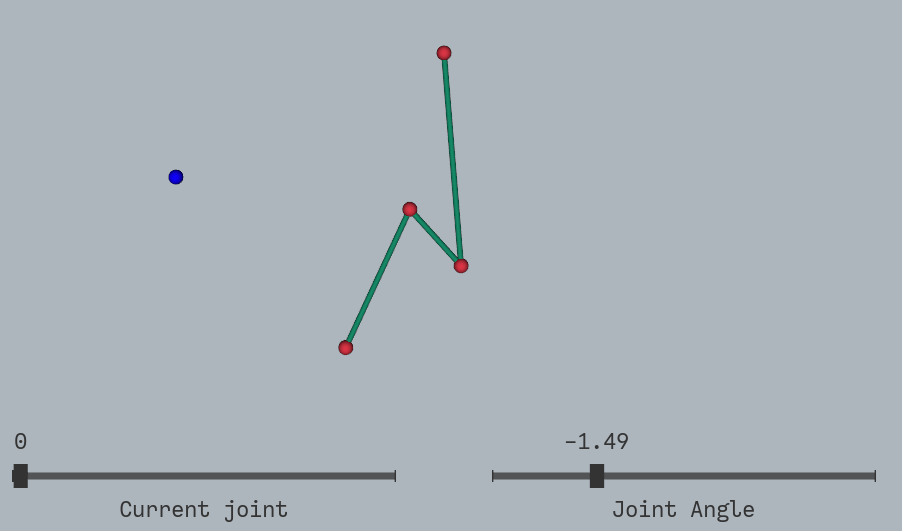
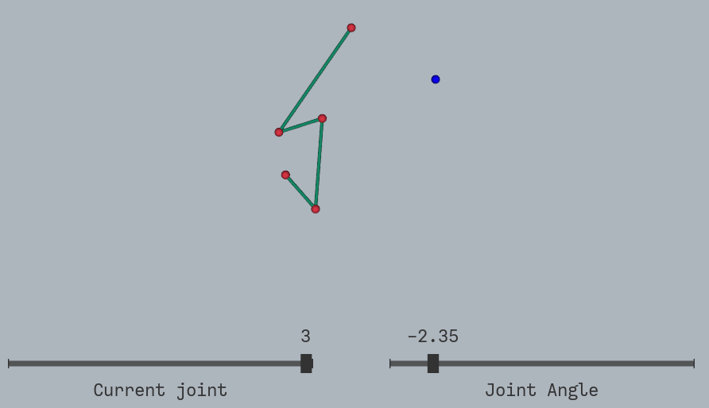
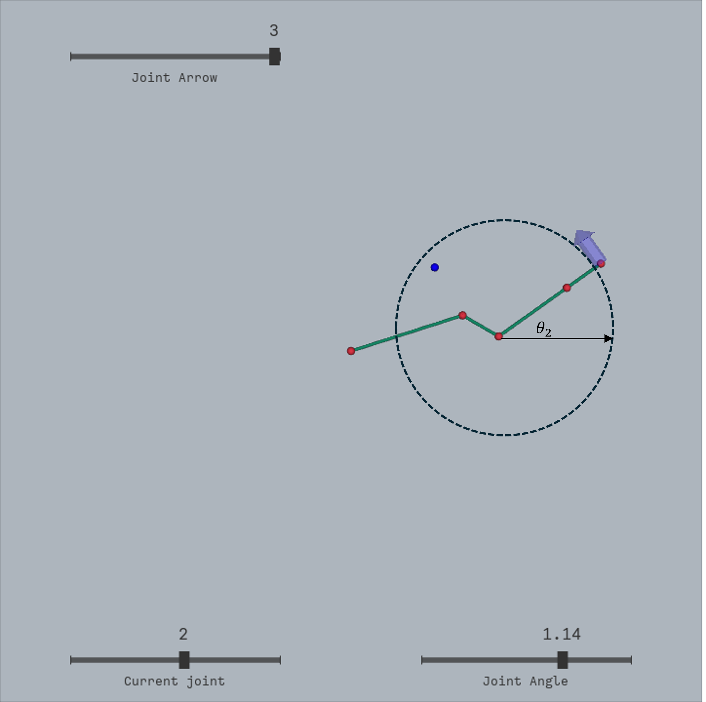
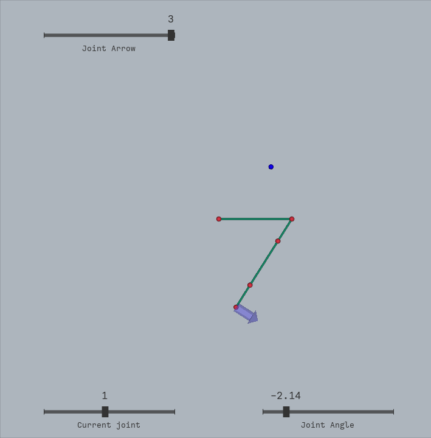
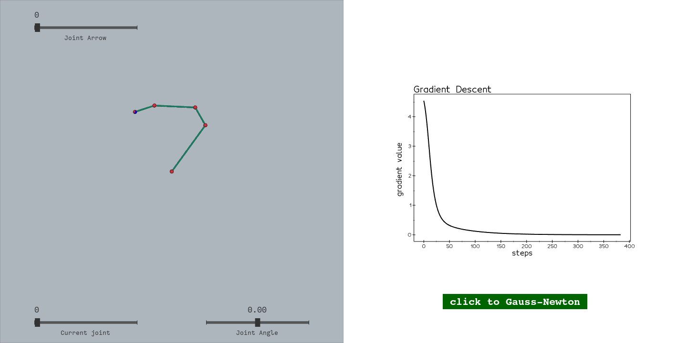
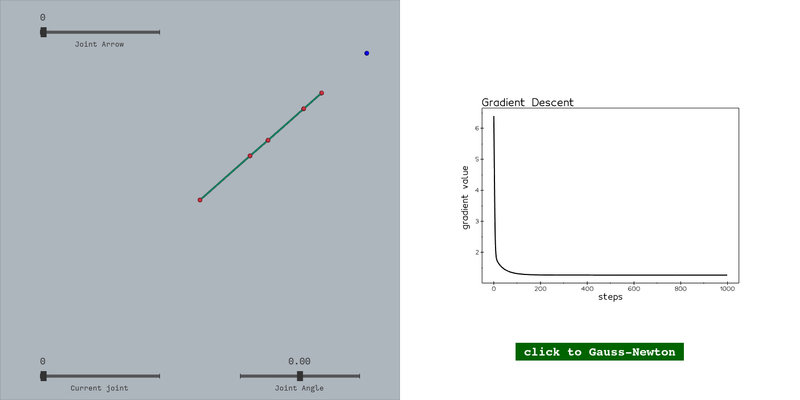
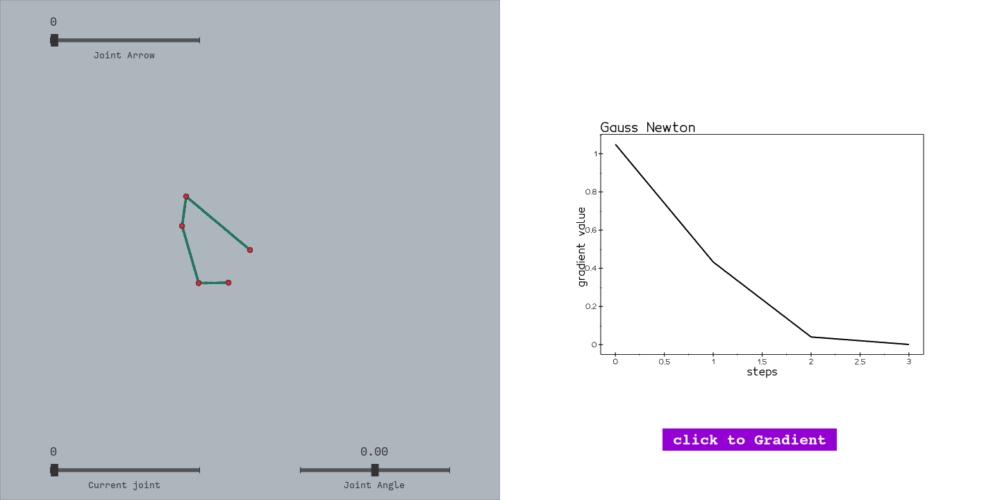
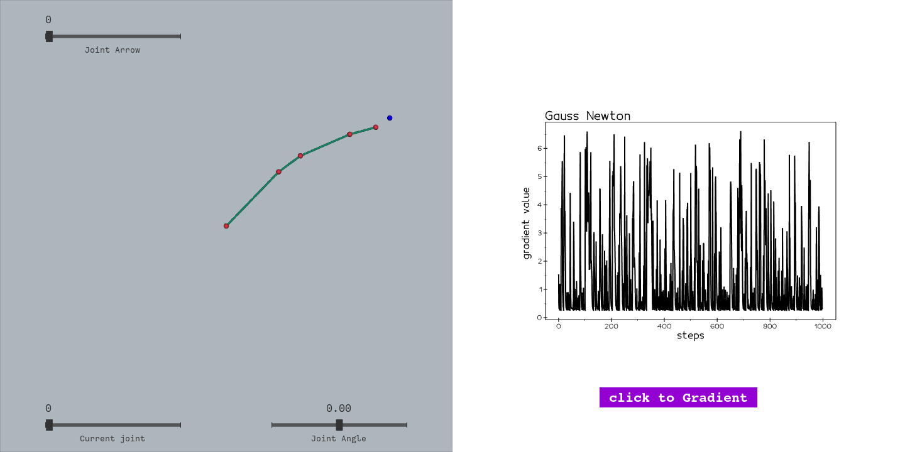

# Animation and Robotics - Assignment 3:   Kinematics

 Click here to read more

**Introduction**

In this assignment, you will implement a simple optimization based inverse kinematics application for a 2D robotic arm with hinge joints. 

The initial code for the assignment contains a partial implementation of a simple robotic arm class with identical links. The constructor accepts the number of links and initializes the relevant values. The class implements Forward Kinematics (FK) for the case of 3 joints, which you will be required to extend, and the implementation of inverse kinematics (IK) is left empty.

The GUI allows the user to view the arm, and change its joint angles. The left slider determines which joint the slider on the right controls. The blue sphere represents the IK target. Clicking anywhere in the window repositions the target.

## Tasks

### Task 1: Extend the implementation of the FK function to any number of joints.

 Subsection 1.1

**different link lengths**

 The original implementation assumed identical link lengths for all joints.

 I modified the `SimpleArm` constructor to accept different link lengths:

 <figure>
     
  <figcaption>
  Figure: An example of a robot arm with link lengths [1.4, 0.5, 1.0]
</figcaption>
</figure>

 Subsection 1.2

**forward kinematics** 

The forward kinematics computation was generalized to support any number of joints using an iterative approach.

I modified the `FK` function to calculate FK for n-links:

 <figure>
     
  <figcaption>Figure: FK for a robot arm with link lengths [1.4, 0.5, 1.0, 0.5]</figcaption>
</figure>

---

### Task 2: Gradient descent based IK (the Jacobian transpose method)

 Subsection 2.2

**Implementation of `VelocityJacobian` method**

Each column of the Jacobian represents the instantaneous velocity
of the end-effector when the corresponding joint moves at unit velocity.

Mathematically,for each joint i , the column:

$J{[:,i]}$ 

is given by:

$J{[:,i]} = Z_i\times(P_{end} - P_i)$

**Visualization of the Jacobian:**

<figure>
     
    <figcaption> Figure: Visualization of the Jacobian for the end-effector while moving joint 3 (index 2). 

- A circle and angle θ are added to enhance understanding of the joint's rotation and the corresponding Jacobian contribution.
    </figcaption>
</figure>

 <figure>
     
  <figcaption>Figure: We move joint 2 [index 1] and see The Jacobian visualization for last joint</figcaption>
</figure>

Arrows appear as tangents to a circle based on the selected joint.
Additionally, their size changes according to the result of the Jacobian calculation.

 Subsection 2.1

**Implementation of `IK` method with `Gradient Decent`**

- The algorithm performs with 1000 steps and alpha=0.01

 <figure>
     
  <figcaption>Figure: IK solution when the target is within the arm's reachable workspace</figcaption>
</figure>

- **In areas farther away:**  
  The manipulator encounters challenges such as:  
  - Loss of degrees of freedom, making adjustments harder.  
  - The target being physically out of reach.  
  - The linear gradient descent approximation being less effective for nonlinear behavior.  

 <figure>
     
  <figcaption>Figure: The arm's behavior when the target is out of reach</figcaption>
</figure>

The gradient value shown in the graph reflects the optimization process.

---

### Task 3: Gauss-Newton based IK (the Jacobian inverse method)

 Subsection 3.1

**Implementation of `IK` method with `Gauss-Newton`**

The Gauss-Newton method uses the pseudo-inverse of the Jacobian:

$\theta_{new} = \theta_{old} + \alpha J^+(x_{target} - x_{current})$

Where $J^+$ is the Moore-Penrose pseudo-inverse:

$J^+ = J^T(JJ^T)^{-1}$

The graph showing the gradient or error value demonstrates how Gauss-Newton converges significantly faster compared to gradient descent. 

 <figure>
     
  <figcaption>Figure: Iterative convergence of the Gauss-Newton method toward the target pose</figcaption>
</figure>

 <figure>
     
  <figcaption>Figure: The arm's behavior when the target is out of reach</figcaption>
</figure>

When the target is out of reach, the Gauss-Newton algorithm produces a noisy and unstable solution.

This happens because the optimization process attempts to minimize the error $(x_{target} - x_{current})$, but the pseudo-inverse cannot fully resolve the discrepancy for unreachable configurations. As a result:
- The gradient oscillates significantly due to the linear approximation not being valid for such cases.
- The manipulator moves erratically, as the algorithm tries to adjust angles to reach an impossible target.

 Subsection 3.2

**Extra degrees of freedom**

To define a unique solution for redundant robots, one approach is to use weights on the joint movements.

By assigning a cost or weight to each joint, the algorithm can prioritize certain joints over others, minimizing unnecessary movement.

This can be done by adding a weighted term to the optimization objective, such as minimizing energy, joint limits, or a desired posture, guiding the system to a preferred configuration.
</figcaption>

