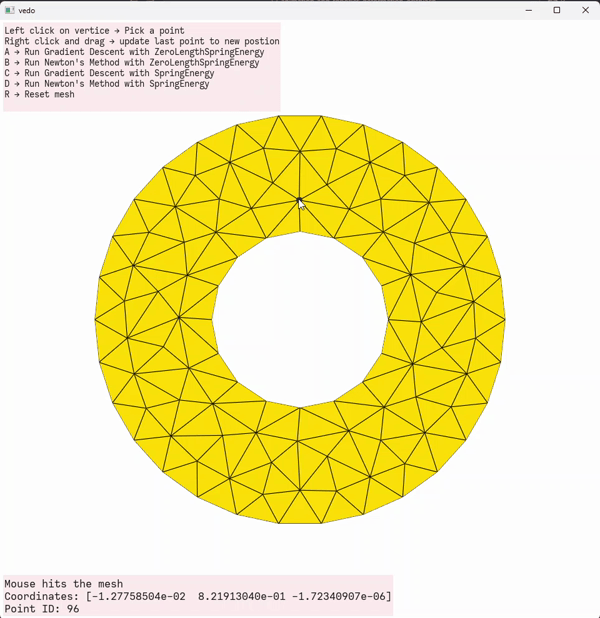

<div align="center">
  <h1>Animation and Robotics</h1>
  <p>Interactive computational methods for optimization, deformation, and kinematics</p>
  
  <!-- Badges -->
  <p>
    
    
  </p>
  
  <!-- Links -->
  <h4>
    <a href="#projects">View Projects</a>
    <span> · </span>
    <a href="#quick-start">Quick Start</a>
  </h4>
  
   
</div> 

## About the Project

- This repository contains three comprehensive projects exploring the fundamental computational methods used in animation and robotics.
- Each project combines theoretical foundations with interactive GUI implementations, allowing real-time parameter manipulation and immediate visual feedback.
- The goal is to provide hands-on experience with optimization algorithms, physical simulation, and robotics through interactive visualization techniques.
 
---

## Projects

<details>
<summary>
Optimization & Visualization
</summary>
<p><em>Interactive optimization algorithms with real-time visualization</em></p>

**Features:**
- Interactive 3D surface navigation
- Gradient Descent vs Newton's Method comparison
- Real-time parameter adjustment
- Visual convergence tracking

<div align="center">
<a href="1-optimization-and-visualization-basics" target="_blank">
  
</a>

> Click the image to checkout the project.

</div>

</details>

<details>
<summary>Mass-Spring Systems</summary>
<p><em>Deformable mesh simulation with interactive controls</em></p>
 
**Features:**
- Custom mesh generation (donut geometry)
- Click-and-drag vertex manipulation
- Multiple energy models
- Real-time deformation simulation


<div align="center">


<a href="2-deformation-mass-spring-systems" target="_blank">
  
</a>

> Click the image to checkout the project.

</div>

</details>

<details>
<summary>Kinematics</summary>
<p><em>2D robotic arm with forward and inverse kinematics</em></p>

**Features:**
- Configurable arm geometry
- Interactive target positioning
- Jacobian visualization
- Multiple IK algorithms

<div align="center">


<a href="3-kinematics" target="_blank">
  
</a>

> Click the image to checkout the project.

</div>
</details>

---

## Quick Start

1. clone the repository with `git clone`:

    `git clone https://github.com/orishlach/animation-and-robotics.git`
    
2. Open the folder with VS Code.
   
3. Choose folder and create a new Python environment (`CTRL-SHIFT-P`, type `python env` and select `Python: Create Environment`).Follow the steps. VS Code should create a new folder called `.venv`.
4. Open a new terminal (`` CTRL-SHIFT-` ``). If VS Code detected the Python environment correcly, the prompt should begin with `(.venv)`. If not, restart VS Code and try again. If it still doesn't make sure the default terminal is `cmd` or `bash` (use `CTRL-SHIFT-P` and then `Terminal: Select Default Profile` to change it) and start a new terminal. If it still fails, ask for help.
5. Install Vedo, a scientific visualization package for python, using `pip install vedo` in the terminal.
6. How to run:
   
   - The file is divided into cell, where each cell is defined by `#%%`.
   - Run the first cell, which has this code, but pressing `CTRL-ENTER`.

    ```python
    #%% Imports
    ```

    - On the first run, VS Code will tell you that it needs to install the ipykernel runtime.
    - Run the whole file, cell-by-cell, by pressing `SHIFT-ENTER`.
    - Running the last cell should result in a new window appearing with the graphics.
 